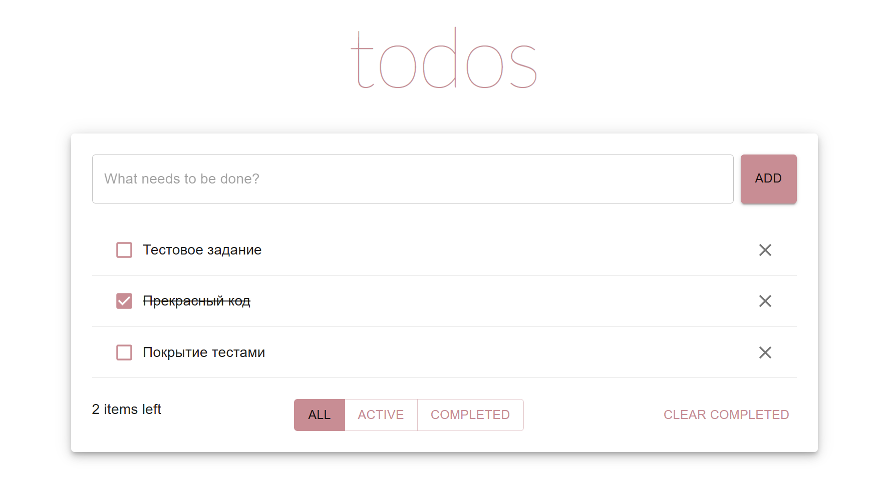
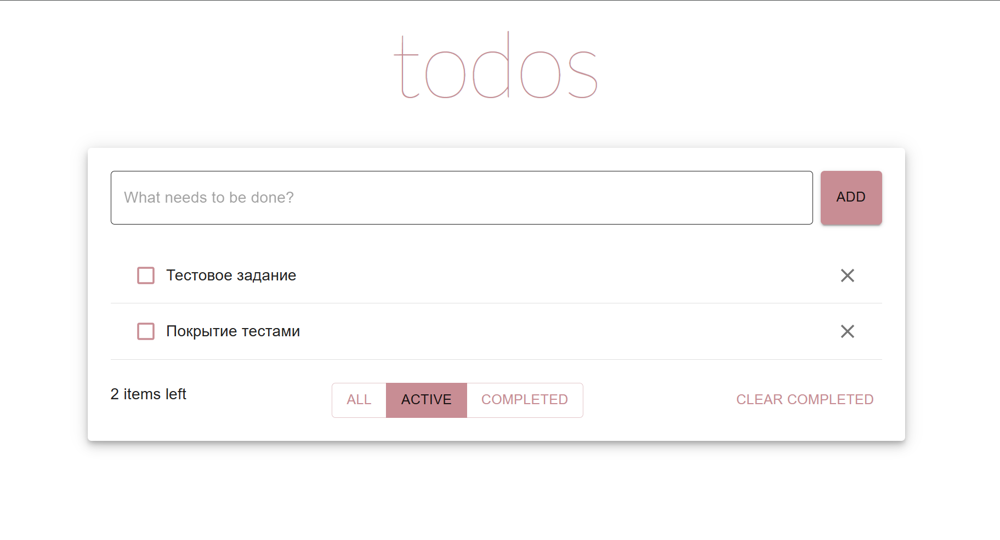
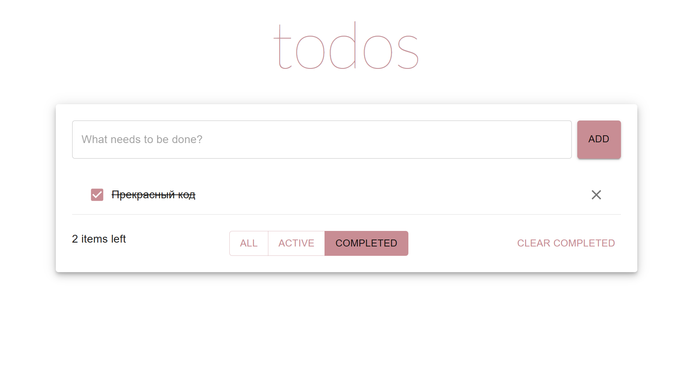

# todo_list

## Описание проекта

Todo_list -- это приложение, предназначенное для управления задачами. Разработано с использованием React и Typescript. В качестве библиотеки компонентов была выбрана Material UI. Для тестирования применялись React Testing Library и Jest.

## Функционал:

- Добавление задач через поле ввода по кнопке add
- Переключение состояния выполнения через чекбокс
- Удаление любой задачи
- Удаление всех выполенных задач
- Фильтрация задач

## Установка и запуск проекта:

Клонировать репозиторий:

    git clone https://github.com/tv-tugova/todo_list.git

Установить зависимости:

    npm i

Запустить приложение:

    npm run start

Запустить тесты:

    npm test

## Скриншоты:

